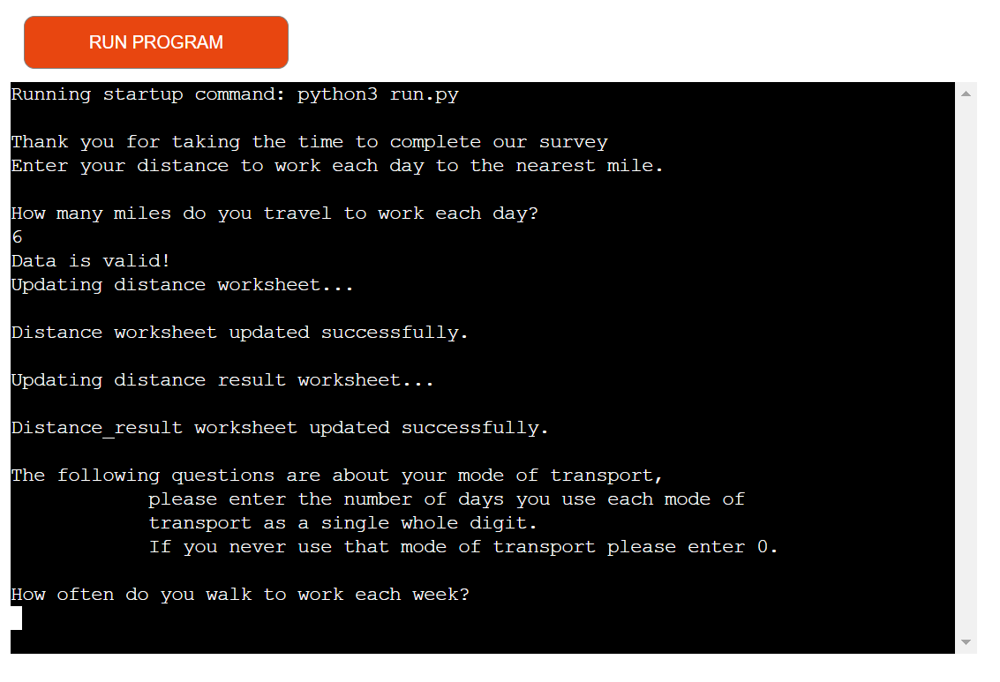
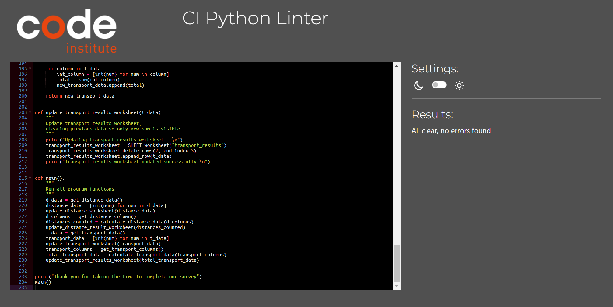

# Travel Survey -  Testing

Visit the deployed app: [here](https://travel-survey-d72fc1637c7d.herokuapp.com/)

- - -

## CONTENTS

- [Travel Survey -  Testing](#travel-survey----testing)
  - [CONTENTS](#contents)
  - [AUTOMATED TESTING](#automated-testing)
    - [PEP8 Validator](#pep8-validator)
  - [MANUAL TESTING](#manual-testing)
    - [Testing User Stories](#testing-user-stories)
    - [Full Testing](#full-testing)
  - [BUGS](#bugs)
    - [Known Bugs](#known-bugs)
    - [Solved Bugs](#solved-bugs)

## AUTOMATED TESTING

### PEP8 LINTER

[PEP8](https://pep8ci.herokuapp.com/) was used to validate the python code on this app. run.py passed with no errors or warnings to show.

## MANUAL TESTING

### Testing User Stories

`First Time Visitors`

| Goals | How are they achieved? |
| :--- | :--- |
| I want to work on my mental well-being finding tools and techniques that suit my lifestlye. | Breathe offers a variety of techniques and tools that can be easily incorporated into day-to-day life. |
| I want the site to be responsive to my device. | I have developed the site with responsiveness in mind. |
| I want the site to be easy to navigate. | Clear headings are used in the navigation bar at the top of the screen these are clear and easy to use on all devices.  |

`Returning Visitors`

|  Goals | How are they achieved? |
| :--- | :--- |
| I want to be able to track my progress. | Going forward I would like to add an interactive tracking tab that monitors users activities and their progress. |

`Frequent Visitors`

| Goals | How are they achieved? |
| :--- | :--- |
| I want to be able to engage with a community also working on their mental wellbeing | I would like to add a login community element so users can meet like minded people and encourage them on their journeys.

### Full Testing

Full testing was performed on the following devices:

* Laptop:
  * Microsoft surface laptop

Each device tested the site using the following browsers:

* Google Chrome
* Safari

| Feature | Expected Outcome | Testing Performed | Result | Pass/Fail |
| --- | --- | --- | --- | --- |
| `Distance Question` |
|  |  |  |  |  |
| Enter value | Data is valid or invalid message appears, data is being processed and sent to distance worksheet message appears.| entered both valid and invalid data | Relevenet messages printed to terminal. | Pass |
| `Formatting Distance Data` |
|  |  |  |  |  |
| Data logged in worksheet | Data sent to results worksheet where it is ordered and a tally created.| Entered several rounds of data, checked worksheet. | Worksheet updated correctly. | Pass |
| `Transport Question` |
|  |  |  |  |  |
| Enter value | Data is valid or invalid message appears, data is being processed and sent to transport worksheet message appears.| entered both valid and invalid data | Relevenet messages printed to terminal. | Pass |
| `Formatting Transport Data` |
|  |  |  |  |  |
| Data logged in worksheet | Data sent to results worksheet where it is summed and splotted on a pie chart.| Entered several rounds of data, checked worksheet. | Worksheet updated correctly. | Pass |

 - - -

## BUGS

### Known Bugs

No known bugs.